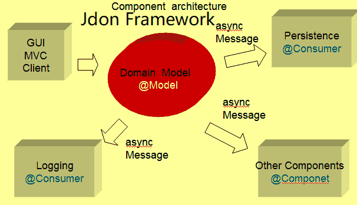
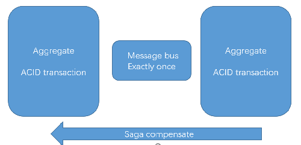
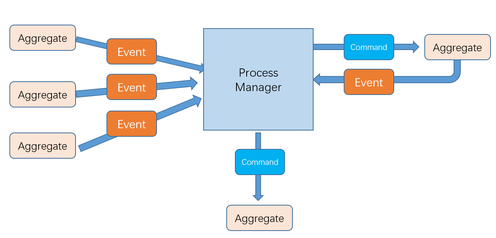
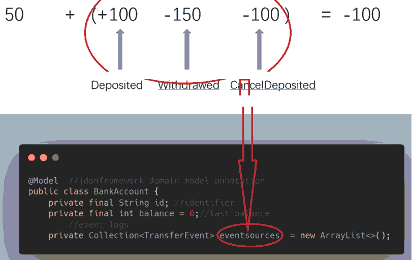
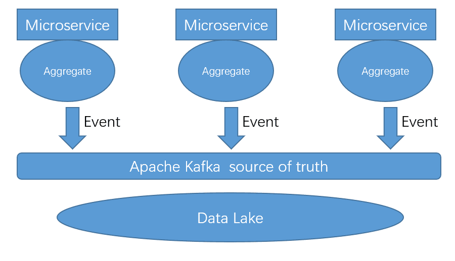

JDON FRAMEWORK
===================================
JdonFramework is a Domain Events framework that supports pub-sub asynchronous programming model.

No any message middlewares similar as Apache Kafka or RabbitMQ, you can directly command domain model doing something,
and listen any domain events from domain model.

using JdonFramework, you can build your Domain Driven Design + CQRS + EventSourcing  applications with asynchronous concurrency and higher throughput.

Jdonframework help you implement a clean and hexagonal architecture!

Context
===================================
Context is king: Context oriented programming(COP)

* Data + Interactive => Being in Context ([DCI](https://en.wikipedia.org/wiki/Data,_context_and_interaction))

* Data+ #SingleResponsibility = Object  => Being in Context ([OOP](https://en.wikipedia.org/wiki/OOP))

* DataStructure + Algorithm = App => Being in Context

* Model + View = Controller => Being in Context ([MVC](https://en.wikipedia.org/wiki/Model%E2%80%93view%E2%80%93controller))

* struct + trait = DDD aggerates => Being in Context 

JdonFramework:

* Domain Model + Domain Events = DDD aggerates =>  Being in Bounded Context (COP: Context oriented programming)

Why DDD?
===================================
Domain-driven design (DDD) is an approach to developing software for complex needs by deeply connecting the implementation to an evolving model of the core business concepts,

DDD's servral concepts are the Heart and Soul of OOD:

		Entities and Identity, Value Objects
		Aggregate Root
		Bounded context

Why Domain Events?
===================================
CQRS: Command-query Responsibility Segregation, at its heart is a simple notion that you can use a different model to update information than the model you use to read information.
domain events is the basice about CQRS and EventSourcing, it is all about what happened in aggregates, and means some changes happened in domain.

In CQRS, using domain events update query model; 
In Eventsourcing, append domain events into storage repository. 

Why Jdonframework?
===================================
Give you a clean architecture!

Jdonframework introduces reactive and event-driven into domain, using jdon, a aggregate root can act as a mailbox(similar as scala's Actors) that is a asynchronous and non-blocking event-sending and event-recipient metaphor.
Event is a better interactive way for aggregate root with each other, instead of directly exposing behavior and hold references to others.
and it can better protect root entity's internal state not expose. and can safely update root's state in non-blocking way [Single Writer Principle](http://www.javacodegeeks.com/2012/08/single-writer-principle.html).

Jdonframework moves mutable state from database to memory, and uses Aggregate Root to guard it, traditional database's data operations (by SQL or JPA/ORM) not need any more, only need send a Command or Event to drive Aggregate Root to change its mutable state by its behaviours

	@Model
	public class AggregateRootA {

		private int state = 100;

		@OnCommand("CommandtoEventA")
		public Object save(ParameterVO parameterVO) {

			//update root's state in non-blocking single thread way (Single Writer)
			this.state = parameterVO.getValue() + state;

		}

	}

Jdonframework work mode is Producer/Consumer, A producer emits to its Consumer by a asynchronous and non-blocking queue made by LMAX Disruptor's RingBuffer.
such as:

@Send("CommandtoEventA") ---> @OnCommand("CommandtoEventA")

There are two kinds of Consumer in jdon:

	@Send --> @OnCommand  (1:1 Queue)
	@Send --> @OnEvent    (1:N topic)

Difference between 'OnCommand' and 'OnEvent' is:

When a event happend otherwhere comes in a aggregate root we regard this event
as a command, and it will action a method annotated with @OnCommand,
and in this method some events will happen. and they will action those methods annotated with @OnEvent.

full example: [click here](https://github.com/banq/jdonframework/blob/master/src/test/java/com/jdon/sample/test/cqrs/a/AggregateRootA.java)

Saga and Distributed transaction
===================================
The Saga pattern is a preferable way of solving distributed transaction problems for a microservice-based architecture. However, it also introduces a new set of problems, such as how to atomically update the database and emit an event?

Jdonframework can atomically update database and emit an event by single-Writer pattern. 

Every aggregate is in a transaction scope, message support transaction delivery by exactly once(Apache Kafka)，Saga can rollback all steps in one process/transcation session.

A process manager acts as a conductor of orchestration, push a forward or backward process.
if any one of all aggregates happend exception or error, the aggregate should send Canceled event to the process manager, and process manager send Cancel command to others, other aggregates will add a Canceled events to their event logs. 

Example:
[transfer account](https://github.com/banq/jdonframework/tree/master/src/test/java/com/jdon/sample/test/bankaccount)

This a aggregate root entity: [BankAccount](https://github.com/banq/jdonframework/blob/master/src/test/java/com/jdon/sample/test/bankaccount/aggregates/BankAccount.java)
~~~~
@Model  //jdonframework domain model annotation
public class BankAccount {
	private final String id; //identifier
	private final int balance = 0;//last balance
        //event logs
	private Collection<TransferEvent> eventsources  = new ArrayList<>();
~~~~

[TransferCommand](https://github.com/banq/jdonframework/blob/master/src/test/java/com/jdon/sample/test/bankaccount/command/TransferCommand.java) is a command from process mananger to all aggregates:
~~~~
public class TransferCommand {

    private final String transactionId;
    private final String aggregateId;
    private final String commandId;
    private final int value;

~~~~
TransactionId is the identifier of a process or transaction session.

TransferCommand has three subclass: [Withdraw](https://github.com/banq/jdonframework/blob/master/src/test/java/com/jdon/sample/test/bankaccount/command/Withdraw.java) [Deposite](https://github.com/banq/jdonframework/blob/master/src/test/java/com/jdon/sample/test/bankaccount/command/Deposit.java) and [Cancel](https://github.com/banq/jdonframework/blob/master/src/test/java/com/jdon/sample/test/bankaccount/command/Cancel.java).

[TransferEvent](https://github.com/banq/jdonframework/blob/master/src/test/java/com/jdon/sample/test/bankaccount/event/TransferEvent.java) is a domain event and value object,its properties are sames as TransferCommand.
command is similar as the input parameter of a function/method,domain event is similar as the output result.
command or event can be packed into payload of a message from message bus/broker.

TransferEvent has too three subclass: [Withdrawed](https://github.com/banq/jdonframework/blob/master/src/test/java/com/jdon/sample/test/bankaccount/event/Withdrawed.java) [Deposited](https://github.com/banq/jdonframework/blob/master/src/test/java/com/jdon/sample/test/bankaccount/event/Deposited.java) and [Canceled](https://github.com/banq/jdonframework/blob/master/src/test/java/com/jdon/sample/test/bankaccount/event/Canceled.java).

When a TransferCommand will be passed to BankAccount::transfer, a BankAccount instance will begin business logic:

~~~~~
	@OnCommand("transfer")
	public void transfer(TransferCommand transferCommand) {
		int balance2 = getBalance()  + transferCommand.getValue();
		if (balance2 > 1000 || balance2 < 0) {
			aggregatePub.next(transferCommand.createCanceled());
		}
		TransferEvent transferEvent = transferCommand.creatTransferEvent();
		eventsources.add(transferEvent);
		aggregatePub.next(transferEvent);
	}

~~~~~

At first it will check Business rule, if balance > 10000 or <0, it can cancel this transfering.

if all logic passed, a TransferEvent will append to eventlog, and command the process manager to push into next step of a process.

The process manager will send cancel command to last steps that has executed in a process, when these aggregate accept the cancel command, they will append a Canceled Event to event logs.
~~~~~
	@OnCommand("cancel")
	public void cancel(Cancel cancel) {
		int balance2 = getBalance()  - cancel.getTransferCommand().getValue();
		if (balance2 > 1000 || balance2 < 0) {
			System.err.println("can not be canceled " + cancel.getTransferCommand().getTransactionId() + " "+cancel.getTransferCommand().getAggregateId());
		}
		eventsources.add(cancel.getTransferCommand().createCanceled());
	}
~~~~~

Append to a event logs no need transaction lock, these called [OLEP](https://queue.acm.org/detail.cfm?id=3321612)

Account balance state is projected in a read/query method:

~~~~~

	private int project(){
		return eventsources.stream().map(e->e.getValue()).reduce(this.balance,(a,b)->a+b);
	}

	public int getBalance() {
		return project();
	}

~~~~~

Projection to state from eventlogs is with java8 stream reduce, similar as Redux from frontend.

Apache Kafka + Eventsourcing + Saga
===================================
Apache Kafka supports Exactly-once delivery, Jdonframework + Saga + Kafka can implement distributed transaction in MircoServices.

[jdon-kafka](https://github.com/banq/jdon-kafka)

[LMAX microservices distributed transaction](https://weareadaptive.com/wp-content/uploads/2017/04/Application-Level-Consensus.pdf)

GETTING STARTED
===================================
online documents :
	English: http://en.jdon.com/
	Chinese: http://www.jdon.com/jdonframework/

In the "doc\english" directory there are all documents about how to use.

In the "doc\chinese" directory there are chinese documents about how to use.

In the "example" directory there are serveral examples that show how to use jdon, in these examples directory run 'mvn package' to get war file.

In the "JdonAccessory" directory there are struts1.x MVC and jdbc templates.

Example Application
===================================
[jivejdon](https://github.com/banq/jivejdon) is a discussion forum/blog/CMS platform powered by 
jdonframework

RELEASE NOTES
===================================

6.9 version.

How to use
===================================

Add jdonframework.jar to your project:
  MAVEN:

		<dependency>
			<groupId>org.jdon</groupId>
			<artifactId>jdonframework</artifactId>
			<version>6.9</version>
		</dependency>

Bugs and Feedback
------------------
For bugs, questions and discussions please use the [Github Issues](https://github.com/banq/jdonframework/issues).

LICENSE
------------------
Licensed under the Apache License, Version 2.0 (the "License"); you may not use this file except in compliance with the License. You may obtain a copy of the License at

http://www.apache.org/licenses/LICENSE-2.0

Unless required by applicable law or agreed to in writing, software distributed under the License is distributed on an "AS IS" BASIS, WITHOUT WARRANTIES OR CONDITIONS OF ANY KIND, either express or implied. See the License for the specific language governing permissions and limitations under the License.